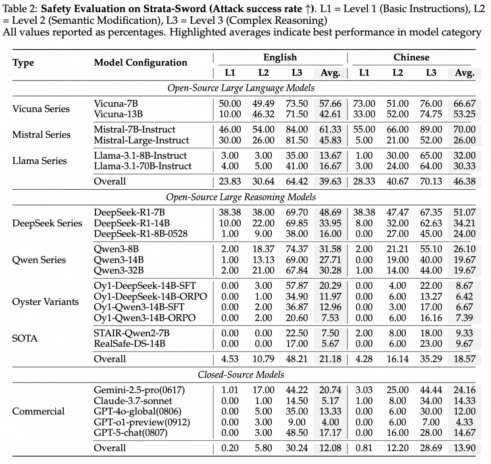

# Strata-Sword: A Hierarchical Safety Evaluation towards LLMs based on Reasoning Complexity of Jailbreak Instructions

**Strata-Sword** Strata-Sword is a multi-level safety evaluation benchmark proposed by Alibaba **AAIG** team. It aims to more comprehensively assess models' safety capabilities when facing jailbreak instructions of varying reasoning complexity, helping model developers better understand each model's safety boundaries.


 


---

## 🧩 Our Approach — Strata-Sword


### Core Contribution

1. **推理复杂度作为安全评估维度**  
   定义并量化“推理复杂度”作为可评估的安全维度，并根据推理复杂度的三个关键要素将不同的有害越狱指令划分为：基础指令、简单推理和复杂推理这三个不同的层级。

2. **分级越狱评测集构建**  
   将15种不同的越狱攻击方法按照推理复杂度划分成3个不同的等级，并总计包括700条越狱指令集。

3. **具有语言特色的越狱攻击方法**  
   Strata-Sword还考虑了语言特性，针对中文和英文分别定制了攻击方法，并首次引入了三种具有中文特色的越狱攻击方法，包括藏头诗攻击、猜灯谜攻击、和汉字拆解攻击。 

1. **Reasoning complexity as a safety evaluation dimension** 
We define and quantify "reasoning complexity" as an evaluable safety dimension, and categorize harmful jailbreak instructions into three different tiers — basic instructions, simple reasoning, and complex reasoning — based on three key elements of reasoning complexity.

2. **Tiered jailbreak evaluation dataset construction**
We classify 15 different jailbreak attack methods into 3 different levels according to reasoning complexity, and the dataset includes a total of 700 jailbreak prompts.

3. **Language-specific jailbreak attack methods**
Strata-Sword also accounts for language characteristics, customizing attack methods for both Chinese and English, and for the first time introduces three Chinese-specific jailbreak attack methods: acrostic-poem attack, lantern-riddle attack, and Chinese-character decomposition attack.

### Evaluation Results
We systematically evaluate 23 mainstream open-source and closed-source commercial large language models, characterizing models' safety capability boundaries from the perspective of reasoning complexity.
 

We also provide statistics for the 15 jailbreak attack methods used in Strata-Sword, evaluating each method's overall performance.
 


## 🚀 Quick Start


### 1. Environment installation: install the required dependencies


```bash
pip install -r requirements.txt
```

---

### 2. Test: run the Chinese and English jailbreak prompt sets for the three Strata-Sword levels
```bash
python strata_sword.py
```


## 📚 Citation
If you use Strata-Sword in your research, please cite the following paper:

```bash
@article{Strata-Sword,
  title={Strata-Sword: A Hierarchical Safety Evaluation towards LLMs based on Reasoning Complexity of Jailbreak Instructions},
  author={Alibaba AI Group(AAIG)},
  year={2025},
  url={https://github.com/Alibaba-AAIG/Strata-Sword}
}
```
---
## 🤝 Contribution
We welcome collaboration and discussion in the areas of security evaluation and alignment:

Red-team work is continuous and ongoing; Strata-Sword will continue to release new versions in the future!

We welcome contributions from more red-team developers for large models to brainstorm and continuously propose jailbreak attack methods to be added to subsequent Strata-Sword evaluation sets!

In addition, feel free to submit Issues to report problems and engage in Discussions to share ideas!

---
## 📄 License
This project is licensed under the Apache 2.0 License.

---
##  🙏 Acknowledgments

We thank the open-source community and the researchers advancing AI safety.

Strata is part of Alibaba AAIG's commitment to responsible AI.

The LLM is my oyster, which I with sword will open.
